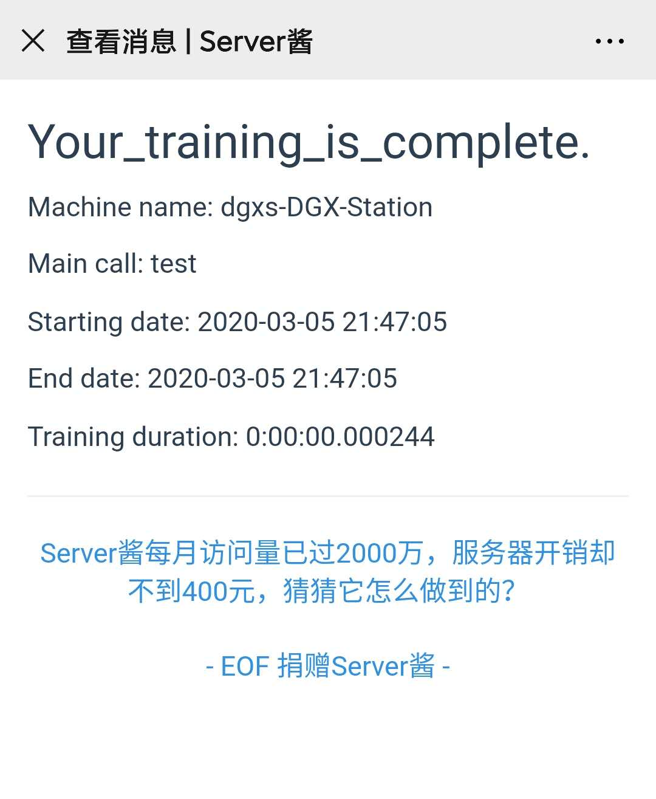

# dinglingling
dinglingling, your program is over!
The code references https://github.com/light8lee/dingdong. The web weChat now is not work, so I refact the code by the [Server Chan](http://sc.ftqq.com/3.version).

## Requirements
- python >= 3.6

## Installation
1. clone the whole project from git and install
```bash
git clone https://github.com/PeijiYang/dinglingling.git
cd dinglingling
python setup.py install
```

## Usage
First, you need to register an account from http://sc.ftqq.com/3.version. Then you will get a SCKEY.  
Just like the examples in test.py, you need to add the decorator ahead of your function:
```python
from dinglingling import wx_reminder

SCKEY = "" # the sckey you get from http://sc.ftqq.com/3.version
proxy = "" # if you needn't proxy, ignore it.

# remind_started: if you need remind you when the function 
# stated, make remind_started = True

@wx_reminder(SCKEY=SCKEY, proxy=proxy, remind_started=False)
def test_correct_func():
    print("hello world")
```

use demo:
<p align="center">
	
</p>
————————————————


## Thanks
- [ServerChan](http://sc.ftqq.com/3.version)
- [light8lee](https://github.com/light8lee)
